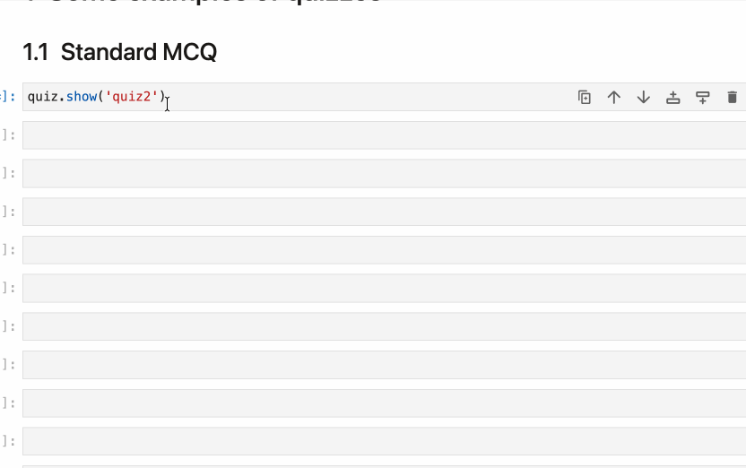
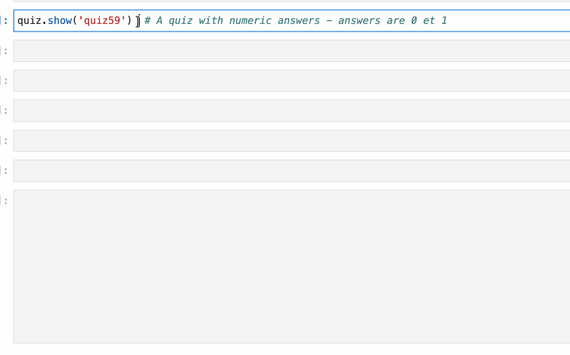
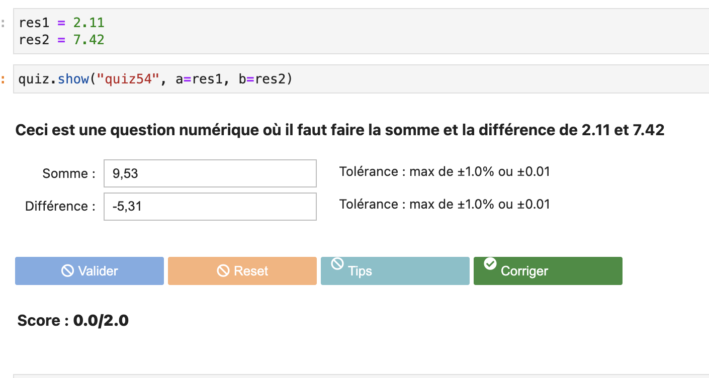
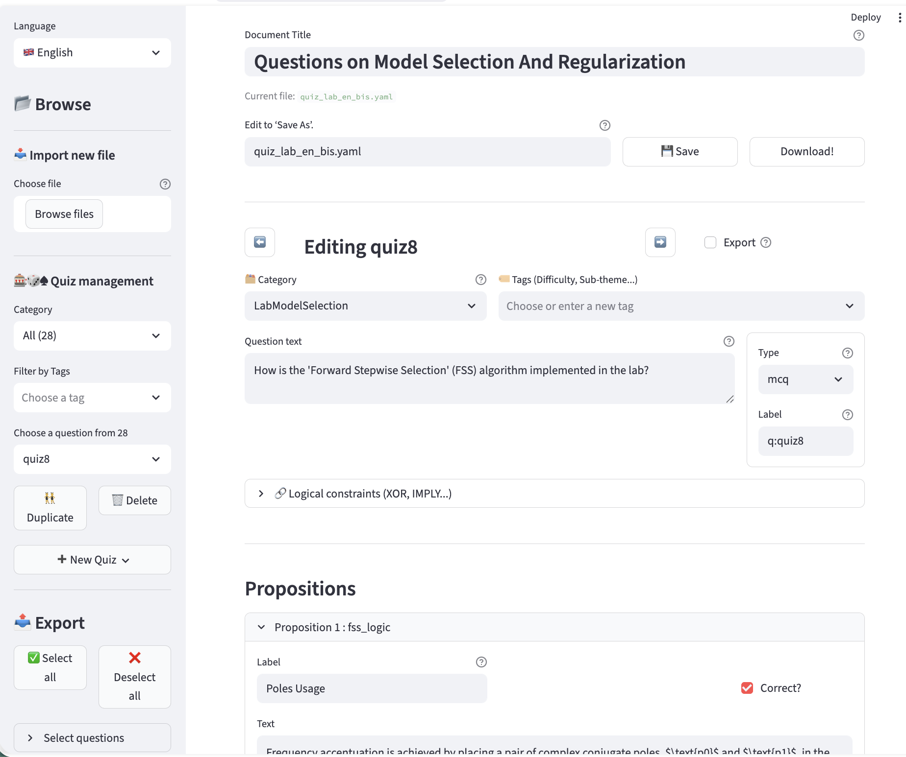
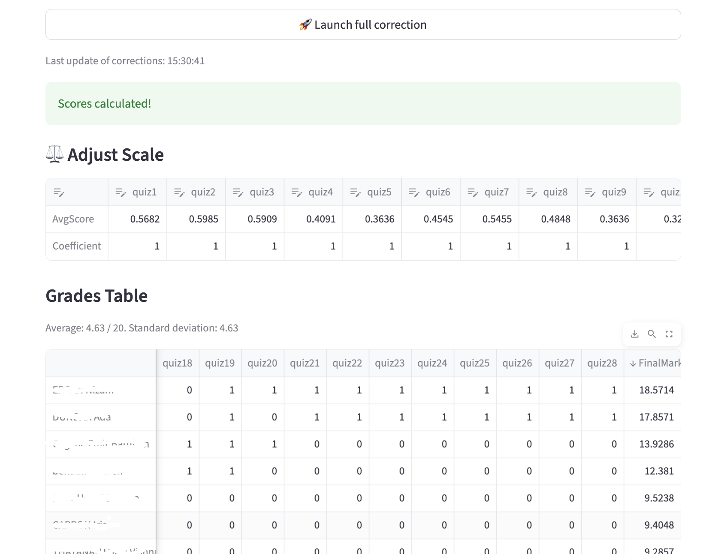

**LabQuiz** is a Python package that allows you to seamlessly integrate interactive quizzes directly into Jupyter notebooks — useful for labs, tutorials, practical assignments, continuous assessment, and controlled exams.

It combines:

* ✅ Multiple-choice and numerical questions
* 🧩 Template-based parameterized questions
* 🔁 Configurable number of attempts
* 💡 Hints and detailed feedback
* 📊 Automatic scoring
* 🌐 Optional remote logging (Google Sheets)
* 📈 Real-time monitoring dashboard (if logging)
* 🔐 Integrity checks and anti-tampering mechanisms

And it comes with two optional companion tools:

* ✏️ **`quiz_editor`** — Create, edit, encrypt, and export question banks
* 📊 **`quiz_dash`** — Monitor, correct, and analyze results in real time
---

* 👉🏼 `Live version`  Try it in [binder](https://mybinder.org/v2/gh/jfbercher/labquiz/main?urlpath=%2Fdoc%2Ftree%2Fextras%2FlabQuizDemo_en_binder.ipynb) 
* `Installation`: 
```bash
# From source
   pip install git+https://github.com/jfbercher/labquiz.git
# or from PyPI
   pip install labquiz
```

---

# 🚀 Why LabQuiz?

LabQuiz is designed for **active learning** and **controlled assessment** in computational notebooks.

It helps instructors:

* Increase student engagement with embedded exercises
* Provide structured feedback during lab sessions
* Monitor progress in real time
* Run controlled tests and exams
* Detect configuration tampering or integrity violations

It helps students:

* Learn through interaction and immediate feedback
* Track their progress
* Work within structured assessment modes

---

# 🚠 What LabQuiz Does

Inside your notebook, you can:

* ✅ Add multiple-choice questions (`mcq`)
* 🔢 Add numerical questions with tolerance (`numeric`)
* 🧩 Create parameterized template questions
* 🔁 Limit attempts
* 💡 Provide hints and corrections
* 📊 Compute automatic scores
* 🌐 Log all activity to a Google Sheet backend (optional)
* 🔐 Enable exam mode with integrity checks

Example:

```python
from labquiz import QuizLab

quiz = QuizLab(URL, "my_quiz.yml", retries=2, exam_mode=False)
quiz.show("quiz1")
```
---

# 📸 Examples

## Multiple-choice question (with hints & correction)




## Numerical question



## Template-based question (dynamic variables)



---

# 🧩 Question Types, Pedagogical modes, Logging

## Question types

LabQuiz supports four types:

| Type               | Description                           |
| ------------------ | ------------------------------------- |
| `mcq`              | Standard multiple-choice              |
| `numeric`          | Numerical answers with tolerance      |
| `mcq-template`     | Context-dependent MCQ                 |
| `numeric-template` | Context-dependent numerical questions |

**Template questions** allow dynamic evaluation based on runtime variables — ideal for practical lab computations.

Example:

```python
quiz.show("quiz54", a=res1, b=res2)
```

Variables can also be generated dynamically
```python
quiz.show("quiz54", autovars=True)
```

The expected solution is dynamically computed using Python expressions.

## Pedagogical modes

LabQuiz supports three pedagogical modes:

* Learning mode (hints + correction available, score display)
* Test mode (limited attempts, score display but no correction)
* Exam mode (no feedback, secure logging)

Quizzes are defined in simple YAML format and support

* Logical constraints (XOR, IMPLY, SAME, IMPLYFALSE)
* Bonuses and penalties
* Relative and absolute tolerances
* Variable generation for templates

## 📊 Remote Logging & Dashboard

All data can be stored in a **Google Sheet backend**. 

LabQuiz can log: Validation events, Parameters, User answers, Integrity hashes... 
LabQuiz also includes multiple anti-cheating mechanisms (Machine fingerprinting, Source hash verification, Detection of parameter tampering, Optional encrypted question files, Runtime integrity daemon...)


---

# ⚙️ Installation

From source (until PyPI release):

```bash
pip install git+https://github.com/jfbercher/labquiz.git
```

## From PyPI

```bash
pip install labquiz
```

Import:

```python
import labquiz
from labquiz import QuizLab
```

Instantiate:

```python
quiz = QuizLab(URL, QUIZFILE,
               retries=2,
               needAuthentication=True,
               mandatoryInternet=False)
```

---


# 🛠 Additional Tools

## ✏️ `quiz_editor` — Build & Export Question Banks

Creating YAML files manually works — but **`quiz_editor` is intended to makes it easier.** It can also be useful outside ob LabQuiz as a general quiz-editor with export capabilities.

### Key features:

* Visual question editing (MCQ, numeric, templates)
* Categories & tags
* Variable generation for templates
* Bonus / malus configuration
* Logical constraints (XOR, IMPLY, SAME, etc.)
* One-click export to:

  * ✅ YAML
  * 🔐 Encrypted version
  * 🌍 Interactive HTML (training mode)
  * 📝 HTML exam version (Google Sheet connected)
  * 📄 AMC–LaTeX format (paper exams)

Online version:
👉 [https://jfb-quizeditor.streamlit.app/](https://jfb-quizeditor.streamlit.app/)

Install locally:

```bash
pip install quiz-editor
```




---

## 📊 `quiz_dash` — Real-Time Monitoring & Correction

`quiz_dash` is the companion dashboard for instructors.

It connects to your Google Sheet backend and provides:

* 📈 Live tracking of submissions
* Live class overview
* 👤 Student-by-student monitoring
* 🔍 Integrity checks (mode changes, retries tampering, hash verification)
* ⚖ Adjustable grading weights
* 🔄 Automatic recalculation
* 📥 CSV export of results

Online version:
👉 [https://jfb-quizdash.streamlit.app/](https://jfb-quizdash.streamlit.app/)




---
## 🌍 Optional: Zero Installation with JupyterLite

LabQuiz can run entirely in the browser using JupyterLite (WASM).
Perfect for fully web-based lab environments.


# 📦 Ecosystem

| Tool            | Purpose                           |
| --------------- | --------------------------------- |
| **labquiz**     | Notebook quiz engine              |
| **quiz_editor** | Question bank creation & export   |
| **quiz_dash**   | Monitoring & correction dashboard |

📦 Repositories:

* [https://github.com/jfbercher/labquiz](https://github.com/jfbercher/labquiz)
* [https://github.com/jfbercher/quiz_editor](https://github.com/jfbercher/quiz_editor)
* [https://github.com/jfbercher/quiz_dash](https://github.com/jfbercher/quiz_dash)

Online tools:

* [https://jfb-quizeditor.streamlit.app/](https://jfb-quizeditor.streamlit.app/)
* [https://jfb-quizdash.streamlit.app/](https://jfb-quizdash.streamlit.app/)

---


# 🎯 Typical Workflow

1. Prepare questions (YAML or `quiz_editor`)
2. Optionally encrypt file
3. Create Google Sheet backend
4. Instantiate `QuizLab` in notebook
5. Run lab / test / exam
6. Monitor using a python console or with `quiz_dash`
7. Post-correct with adjustable grading

---

# 🏁 Demonstration

See:

* `labQuizDemo.ipynb` in `extras/`
* 👉🏼 `Live version` 👈  Try it in [binder](https://mybinder.org/v2/gh/jfbercher/labquiz/main?urlpath=%2Fdoc%2Ftree%2Fextras%2FlabQuizDemo_en_binder.ipynb) 

---

# 📜 License

GPL-3.0 license
